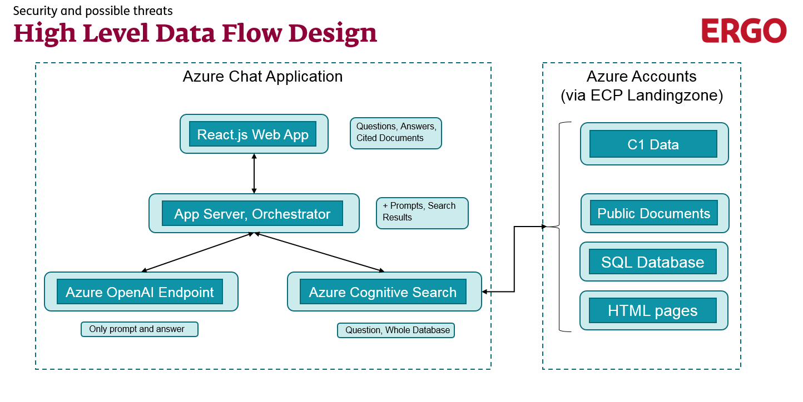
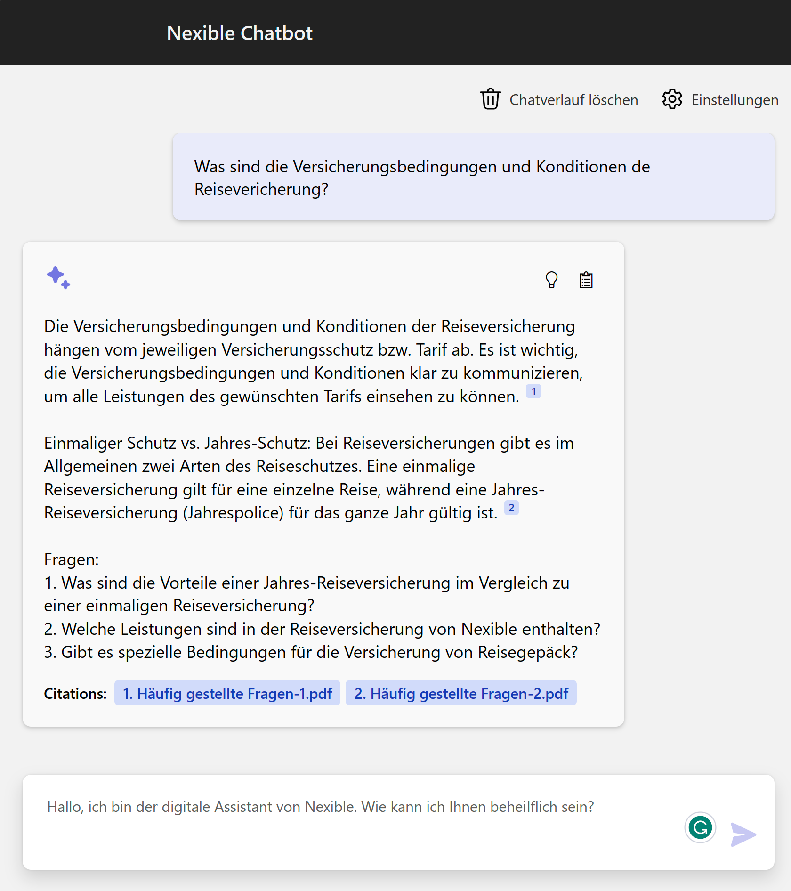

# Nexible Chatbot with Azure OpenAI and Cognitive Search

This prototype demonstrates the Retrieval Augmented Generation (RAG) pattern. It uses Azure OpenAI Service to access the 
ChatGPT model (gpt-35-turbo), the ada-002 text embedding model, and Azure Cognitive Search for data indexing and retrieval.

## Features

* Chat interface with citations and source content tracking.
* Implements Chain of Thought model for RAG chat. ReACT [arXiv:2210.03629] and MKRL [arXiv:2205.00445] approaches are in active development.

### Project setup

First install the required tools:

* [Azure Developer CLI](https://aka.ms/azure-dev/install)
* [Python 3.9+](https://www.python.org/downloads/)
  * **Important**: Python and the pip package manager must be in the path in Windows for the setup scripts to work.
  * **Important**: Ensure you can run `python --version` from console. On Ubuntu, you might need to run `sudo apt install python-is-python3` to link `python` to `python3`.
* [Node.js 14+](https://nodejs.org/en/download/)
* [Powershell 7+ (pwsh)](https://github.com/powershell/powershell) - For Windows users only.
  * **Important**: Ensure you can run `pwsh.exe` from a PowerShell terminal. If this fails, you likely need to upgrade PowerShell.

### Deployment:

1. Run `azd auth login`
2. Run `azd up` - This will provision Azure resources and deploy this sample to those resources, including building the search index based on the files found in the `./data` folder.

If you already have existing Azure resources and only code changes were made, you can re-use those by setting `azd` environment values and just call:
1. Run `azd deploy`

### Running locally

You can only run locally **after** having successfully run the `azd up` command. If you haven't yet, follow the steps in [Azure deployment](#azure-deployment) above.

1. Run `azd auth login`
2. Change dir to `app`
3. Run `./start.ps1` or `./start.sh` depending on your OS.

## Using the app

* In Azure: navigate to the Azure WebApp deployed by azd. The URL is printed out when azd completes (as "Endpoint"), or you can find it in the Azure portal.
* Running locally: navigate to 127.0.0.1:50505

Once in the web app:

* Try different topics in chat or Q&A context. For chat, try follow up questions, clarifications, ask to simplify or elaborate on answer, etc.
* Explore citations and sources
* Click on "settings" to try different options, tweak prompts, etc.

