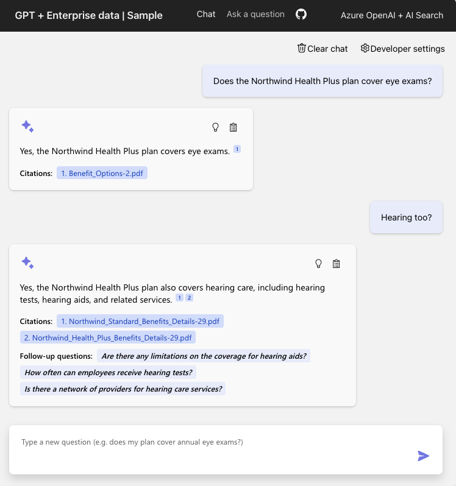

# Nexible ChatBot

## Table of Contents

- [Features](#features)
- [Azure account requirements](#azure-account-requirements)
- [Azure deployment](#azure-deployment)
  - [Cost estimation](#cost-estimation)
  - [Project setup](#project-setup)
    - [Local environment](#local-environment)
  - [Deploying from scratch](#deploying-from-scratch)
  - [Deploying with existing Azure resources](#deploying-with-existing-azure-resources)
  - [Deploying again](#deploying-again)
- [Enabling optional features](#enabling-optional-features)
  - [Enabling authentication](#enabling-authentication)
  - [Enabling login and document level access control](#enabling-login-and-document-level-access-control)
- [Using the app](#using-the-app)
- [Running locally](#running-locally)
- [Monitoring with Application Insights](#monitoring-with-application-insights)
- [Customizing the UI and data](#customizing-the-ui-and-data)

This app demonstrates a few approaches for creating ChatGPT-like experiences over your own data using the Retrieval Augmented Generation pattern. It uses Azure OpenAI Service to access the ChatGPT model (gpt-35-turbo), and Azure AI Search for data indexing and retrieval.

Just provide your own sample data, and you can have a fully deployed ChatBot with just one command! 


## Features

* Chat and Q&A interfaces
* Explores various options to help users evaluate the trustworthiness of responses with citations, tracking of source content, etc.
* Shows possible approaches for data preparation, prompt construction, and orchestration of interaction between model (ChatGPT) and retriever (AI Search)
* Settings directly in the UX to tweak the behavior and experiment with options
* Performance tracing and monitoring with Application Insights



## Azure account requirements

**IMPORTANT:** In order to deploy and run this example, you'll need:

* **Azure subscription with access enabled for the Azure OpenAI service**. You can request access with [this form](https://aka.ms/oaiapply). If your access request to Azure OpenAI service doesn't match the [acceptance criteria](https://learn.microsoft.com/legal/cognitive-services/openai/limited-access?context=%2Fazure%2Fcognitive-services%2Fopenai%2Fcontext%2Fcontext), you can use [OpenAI public API](https://platform.openai.com/docs/api-reference/introduction) instead. Learn [how to switch to an OpenAI instance](#openaicom-openai).
* **Azure account permissions**:
  * Your Azure account must have `Microsoft.Authorization/roleAssignments/write` permissions, such as [Role Based Access Control Administrator](https://learn.microsoft.com/azure/role-based-access-control/built-in-roles#role-based-access-control-administrator-preview), [User Access Administrator](https://learn.microsoft.com/azure/role-based-access-control/built-in-roles#user-access-administrator), or [Owner](https://learn.microsoft.com/azure/role-based-access-control/built-in-roles#owner). If you don't have subscription-level permissions, you must be granted [RBAC](https://learn.microsoft.com/azure/role-based-access-control/built-in-roles#role-based-access-control-administrator-preview) for an existing resource group and [deploy to that existing group](#existing-resource-group).
  * Your Azure account also needs `Microsoft.Resources/deployments/write` permissions on the subscription level.

## Azure deployment

### Cost estimation

Pricing varies per region and usage, so it isn't possible to predict exact costs for your usage.
However, you can try the [Azure pricing calculator](https://azure.com/e/8ffbe5b1919c4c72aed89b022294df76) for the resources below.

- Azure App Service: Basic Tier with 1 CPU core, 1.75 GB RAM. Pricing per hour. [Pricing](https://azure.microsoft.com/pricing/details/app-service/linux/)
- Azure OpenAI: Standard tier, ChatGPT and Ada models. Pricing per 1K tokens used, and at least 1K tokens are used per question. [Pricing](https://azure.microsoft.com/en-us/pricing/details/cognitive-services/openai-service/)
- Azure AI Document Intelligence: SO (Standard) tier using pre-built layout. Pricing per document page, sample documents have 261 pages total. [Pricing](https://azure.microsoft.com/pricing/details/form-recognizer/)
- Azure AI Search: Standard tier, 1 replica, free level of semantic search. Pricing per hour. [Pricing](https://azure.microsoft.com/pricing/details/search/)
- Azure Blob Storage: Standard tier with ZRS (Zone-redundant storage). Pricing per storage and read operations. [Pricing](https://azure.microsoft.com/pricing/details/storage/blobs/)
- Azure Monitor: Pay-as-you-go tier. Costs based on data ingested. [Pricing](https://azure.microsoft.com/pricing/details/monitor/)

⚠️ To avoid unnecessary costs, remember to take down your app if it's no longer in use,
either by deleting the resource group in the Portal or running `azd down`.

### Project setup

#### Local environment

First install the required tools:

* [Azure Developer CLI](https://aka.ms/azure-dev/install)
* [Python 3.9, 3.10, or 3.11](https://www.python.org/downloads/)
  * **Important**: Python and the pip package manager must be in the path in Windows for the setup scripts to work.
  * **Important**: Ensure you can run `python --version` from console. On Ubuntu, you might need to run `sudo apt install python-is-python3` to link `python` to `python3`.
* [Node.js 14+](https://nodejs.org/en/download/)
* [Git](https://git-scm.com/downloads)
* [Powershell 7+ (pwsh)](https://github.com/powershell/powershell) - For Windows users only.
  * **Important**: Ensure you can run `pwsh.exe` from a PowerShell terminal. If this fails, you likely need to upgrade PowerShell.

Then bring down the project code:

1. Clone this repo
1. Run `azd auth login`
1. Run `azd init`
    * note that this command will initialize a git repository and you do not need to clone this repository

### Deploying from scratch

Execute the following command, if you don't have any pre-existing Azure services and want to start from a fresh deployment.

1. Run `azd up` - This will provision Azure resources and deploy this sample to those resources, including building the search index based on the files found in the `./data` folder.
1. After the application has been successfully deployed you will see a URL printed to the console.  Click that URL to interact with the application in your browser.
It will look like the following:


### Deploying with existing Azure resources

If you already have existing Azure resources, you can re-use those by setting `azd` environment values.

#### Existing resource group

1. Run `azd env set AZURE_RESOURCE_GROUP {Name of existing resource group}`
1. Run `azd env set AZURE_LOCATION {Location of existing resource group}`

### Deploying again

If you've only changed the backend/frontend code in the `app` folder, then you don't need to re-provision the Azure resources. You can just run:

```azd deploy```

If you've changed the infrastructure files (`infra` folder or `azure.yaml`), then you'll need to re-provision the Azure resources. You can do that by running:

```azd up```

## Enabling optional features

### Enabling GPT-4 Turbo with Vision

This section covers the integration of GPT-4 Vision with Azure AI Search. Learn how to enhance your search capabilities with the power of image and text indexing, enabling advanced search functionalities over diverse document types. For a detailed guide on setup and usage, visit our [Enabling GPT-4 Turbo with Vision](docs/gpt4v.md) page.

### Enabling authentication

By default, the deployed Azure web app will have no authentication or access restrictions enabled, meaning anyone with routable network access to the web app can chat with your indexed data.  You can require authentication to your Azure Active Directory by following the [Add app authentication](https://learn.microsoft.com/azure/app-service/scenario-secure-app-authentication-app-service) tutorial and set it up against the deployed web app.

To then limit access to a specific set of users or groups, you can follow the steps from [Restrict your Azure AD app to a set of users](https://learn.microsoft.com/azure/active-directory/develop/howto-restrict-your-app-to-a-set-of-users) by changing "Assignment Required?" option under the Enterprise Application, and then assigning users/groups access.  Users not granted explicit access will receive the error message -AADSTS50105: Your administrator has configured the application <app_name> to block users unless they are specifically granted ('assigned') access to the application.-

### Enabling login and document level access control

By default, the deployed Azure web app allows users to chat with all your indexed data. You can enable an optional login system using Azure Active Directory to restrict access to indexed data based on the logged in user. Enable the optional login and document level access control system by following [this guide](./LoginAndAclSetup.md).

## Monitoring with Application Insights

By default, deployed apps use Application Insights for the tracing of each request, along with the logging of errors.

To see the performance data, go to the Application Insights resource in your resource group, click on the "Investigate -> Performance" blade and navigate to any HTTP request to see the timing data.
To inspect the performance of chat requests, use the "Drill into Samples" button to see end-to-end traces of all the API calls made for any chat request:


To see any exceptions and server errors, navigate to the "Investigate -> Failures" blade and use the filtering tools to locate a specific exception. You can see Python stack traces on the right-hand side.

You can also see chart summaries on a dashboard by running the following command:

```shell
azd monitor
```

## Clean up

To clean up all the resources created by this sample:

1. Run `azd down`
2. When asked if you are sure you want to continue, enter `y`
3. When asked if you want to permanently delete the resources, enter `y`

The resource group and all the resources will be deleted.
